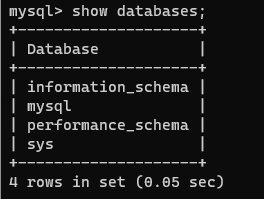
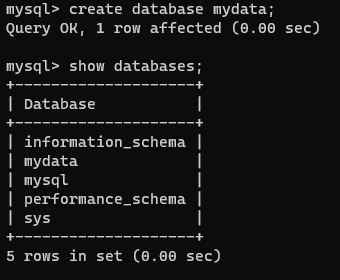
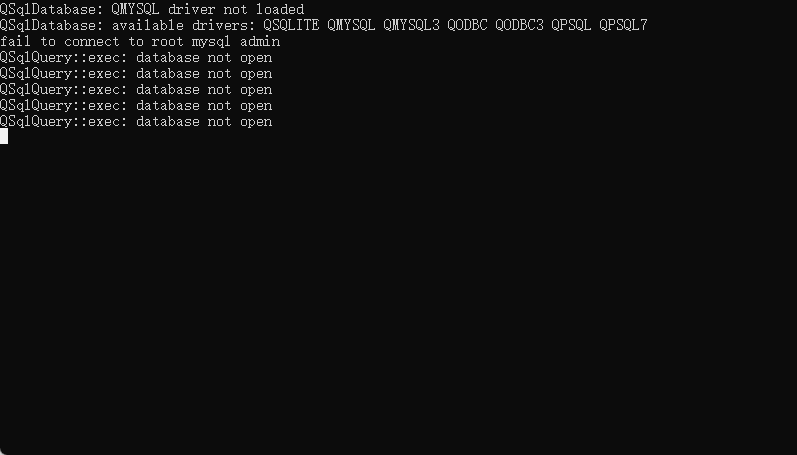
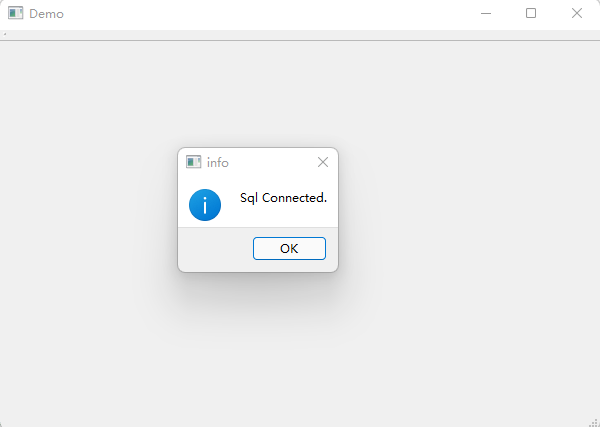

# Qt5之数据库

### 一、安装配置MySQL数据库

1.打开管理员终端，输入：mysqld install启动服务

2.登录MySQL：mysql -u root -p ，修改密码：alter user 'root'@'localhost' identified by 'root'

3.查看现有数据库：show databases; （注意后面有个分号）



4.创建数据库：create database mydata;



5.退出MySQL：exit;


### 二、测试MySQL程序

1.在.pro文件中添加：QT += sql

2.添加打开MySQL数据库代码：

```c++
QSqlDatabase db = QSqlDatabase::addDatabase("QMYSQL");
db.setHostName("localhost");
db.setDatabaseName("mydata");
db.setUserName("root");
db.setPassword("");
```

3.添加测试代码：

```C++
if (!db.open())
	qDebug() << "Failed to connect to root mysql admin";
    else qDebug() << "connect success!";
```

4.将MySQL数据库安装路径下的lib文件夹中的libmysql.dll文件复制到Qt的bin文件夹下，运行程序。



5.结果报错失败，分析原因应该是Qt是32位版本，而MySQL数据库是64位版本。而MySQL数据库最新8.0+版本没有32位版本，低版本MySQL数据库命令体验不好。于是转换思路，通过ODBC连接MySQL数据库。ODBC提供了一种标准的API（应用程序编程接口）方法来访问数据库管理系统（DBMS）。这些API利用SQL来完成其大部分任务。ODBC本身也提供了对SQL语言的支持，用户可以直接将SQL语句送给ODBC。ODBC的设计者们努力使它具有最大的独立性和开放性：与具体的编程语言无关，与具体的数据库系统无关，与具体的操作系统无关。简单的说就是我的qt中含有ODBC的驱动，所以利用ODBC去使用MySQL数据库。

### 三、安装配置ODBC

1.下载与Qt匹配的32位的ODBC，然后使用默认安装。

2.打开ODBC数据源，添加MySQL的DSN，点击test，出现下图所示说明连接成功。


3.Qt通过ODBC连接MySQL数据库，如下图，连接成功。


### 四、安装配置Visual Studio的Qt开发环境

1.下载安装Visual Studio 2017 community，选择使用C++桌面开发，安装。

2.visual studio安装qt拓展插件：打开vs2017，依次选择工具->拓展和更新，搜索qt，选择Qt Visual Studio Tools安装，关闭vs2017，等待完成安装后重启。

3.标题栏多出一个qt vs tools，选择qt option，添加msvc2017的路径。

4.配置qt编译环境的系统环境变量。

### 五、使用Qt编译MySQL动态库

1.打开Qt源码中的"mysql.pro"项目，并将对"mysql.pro"和"qsqldriverbase.pri"文件代码进行更改

mysql.pro：

```C++
TARGET = qsqlmysql

HEADERS += $$PWD/qsql_mysql_p.h
SOURCES += $$PWD/qsql_mysql.cpp $$PWD/main.cpp

#QMAKE_USE += mysql

OTHER_FILES += mysql.json

PLUGIN_CLASS_NAME = QMYSQLDriverPlugin

INCLUDEPATH += $$quote(D:/Software/mysql-8.0.11-winx64/include)
DEPENDPATH += $$quote(D:/Software/mysql-8.0.11-winx64/include)
LIBS += $$quote(D:/Software/mysql-8.0.11-winx64/lib/libmysql.lib)

include(../qsqldriverbase.pri)

```

qsqldriverbase.pri：

```C++
QT  = core core-private sql-private

# For QMAKE_USE in the parent projects.
#include($$shadowed($$PWD)/qtsqldrivers-config.pri)
include(./configure.pri)

PLUGIN_TYPE = sqldrivers
load(qt_plugin)

DEFINES += QT_NO_CAST_TO_ASCII QT_NO_CAST_FROM_ASCII

```

2.更改完成后构建项目，构建项目完成后，可以在路径"D:\plugins\sqldrivers"下找到mysql动态库文件。

3.将"qsqlmysql.dll"及"qsqlmysqld.dll"文件复制到以下路径：D:\Software\Qt5.14.0\5.14.0\msvc2017_64\plugins\sqldrivers。

4.使用VS编写代码测试Qt与MySQL的连接，在创建项目时，注意在Qt Modules选项中勾选"SQL"，测试结果如下图。



