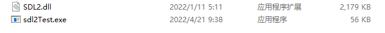
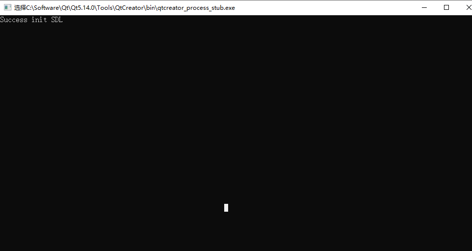

### 配置Qt+SDL2环境

1.下载SDL-devel-VC文件。

2.将include和lib文件夹放到工程文件夹下。

3.在pro文件中添加路径

```C++
INCLUDEPATH += $$PWD/ffmpeg/include\
               $$PWD/SDL2/include
LIBS += -L$$PWD/ffmpeg/lib -lavutil -lavformat -lavcodec -lavdevice -lavfilter -lpostproc -lswresample -lswscale\
        -L$$PWD/SDL2/lib/x64 -lSDL2

```

4.添加头文件

```C++
extern "C" {
#include <SDL_audio.h>
#include <SDL_config.h>
#include <SDL_main.h>
#include <SDL_name.h>
#include <SDL_types.h>

#include "SDL.h"
#include "libavcodec/avcodec.h"
#include "libavfilter/avfilter.h"
#include "libavformat/avformat.h"
#include "libavutil/avassert.h"
#include "libavutil/ffversion.h"
#include "libavutil/frame.h"
#include "libavutil/imgutils.h"
#include "libavutil/opt.h"
#include "libavutil/pixdesc.h"
#include "libavutil/time.h"
#include "libswresample/swresample.h"
#include "libswscale/swscale.h"
}
```

5.将lib文件夹下SDL.dll文件放到bin文件夹可执行文件同目录下。



6.测试结果.

